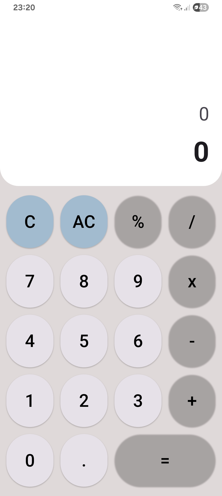
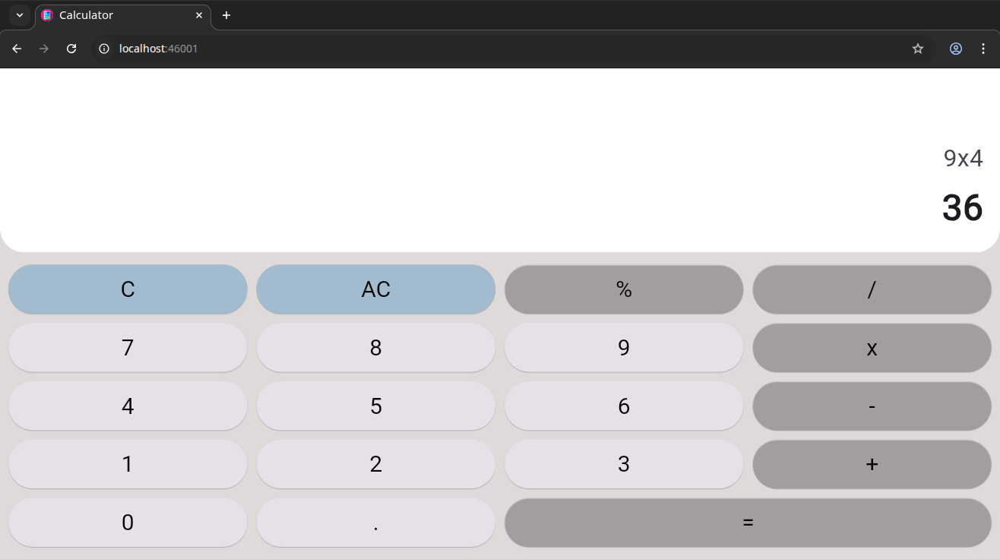

<div align="center" text-align="center">
    

<p align="center">
        <a href="https://flutter.dev" target="_blank"></a>
        <a href="https://dart.dev" target="_blank"></a>
        <a href="LICENSE" target="_blank"></a>
        <br>
        <a href="https://github.com/brunoliratm/Flutter-Calculator/stargazers" target="_blank"></a>
        <a href="https://github.com/brunoliratm/Flutter-Calculator/network/members" target="_blank"></a>
</p>
</div>

A simple and elegant calculator app built with Flutter.
This project is the evolution of a Dart console application, now rebuilt with a full mobile user interface.

<br>

## ✨ Features

* Supports basic arithmetic operations: `+`, `-`, `*`, `/`.
* Clean, responsive, and easy-to-use interface.
* Clear (C) and backspace (AC) functionality.

<br>

## 📱 Screenshots


<details>
<summary>Show screenshots</summary>

<br>




</details>

<br>

## 🚀 Getting Started

To get a local copy up and running, follow these simple steps.

### Prerequisites

* You must have the [Flutter SDK](https://flutter.dev/docs/get-started/install) installed on your machine.

### Installation & Run

1. Clone the repository:

  ```bash
  git clone https://github.com/brunoliratm/Flutter-Calculator.git
  ```

2. Navigate to the project directory:

  ```bash
  cd Flutter-Calculator
  ```

3. Install dependencies:

  ```bash
  flutter pub get
  ```

4. Run the application:

  ```bash
  flutter run
  ```

  *(Alternatively, run the project from your favorite IDE like VS Code or Android Studio).*

<br>

## 🛠️ Tech Stack

* [**Flutter**](https://flutter.dev/) - The UI software development kit.
* [**Dart**](https://dart.dev/) - The programming language.
* [**math_expressions**](https://pub.dev/packages/math_expressions) - For parsing and evaluating mathematical expressions.

<br>

## 👨‍💻 Author

Project developed by **[@Bruno Magno](https://github.com/brunoliratm)**.

<br>

## 📄 License

This project is licensed under the MIT License - see the [LICENSE](LICENSE) file for details.
